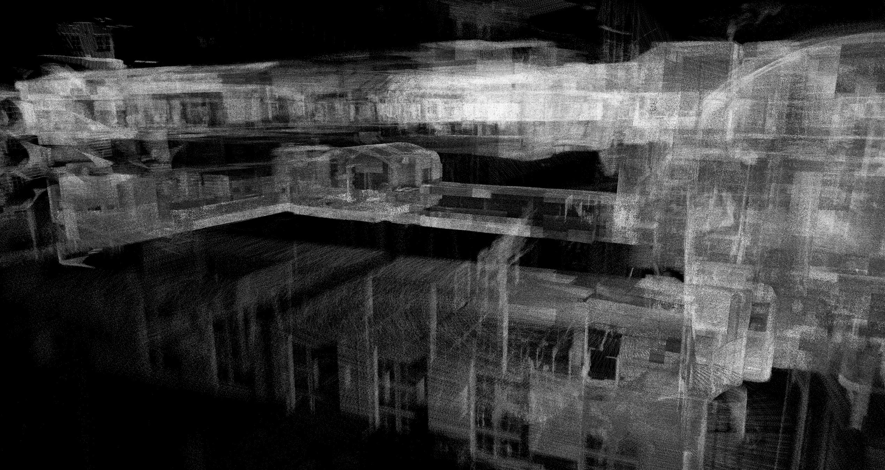

.. Copyright 2018 The Cartographer Authors

.. Licensed under the Apache License, Version 2.0 (the "License");
   you may not use this file except in compliance with the License.
   You may obtain a copy of the License at

..      http://www.apache.org/licenses/LICENSE-2.0

.. Unless required by applicable law or agreed to in writing, software
   distributed under the License is distributed on an "AS IS" BASIS,
   WITHOUT WARRANTIES OR CONDITIONS OF ANY KIND, either express or implied.
   See the License for the specific language governing permissions and
   limitations under the License.

.. cartographer SHA: 30f7de1a325d6604c780f2f74d9a345ec369d12d
.. cartographer_ros SHA: 44459e18102305745c56f92549b87d8e91f434fe

.. _assets_writer:

Exploiting the map generated by Cartographer ROS
================================================

As sensor data come in, the state of a SLAM algorithm such as Cartographer evolves to stay *the current best estimate* of a robot's trajectory and surroundings.
The most accurate localization and mapping Cartographer can offer is therefore the one obtained when the algorithm finishes.
Cartographer can serialize its internal state in a ``.pbstream`` file format which is essentially a compressed protobuf file containing a snapshot of the data structures used by Cartographer internally.

To run efficiently in real-time, Cartographer throws most of its sensor data away immediately and only works with a small subset of its input, the mapping used internally (and saved in ``.pbstream`` files) is then very rough.
However, when the algorithm finishes and a best trajectory is established, it can be recombined *a posteriori* with the full sensors data to create a high resolution map.

Cartographer makes this kind of recombination possible using ``cartographer_assets_writer``.
The assets writer takes as input

1. the original sensors data that has been used to perform SLAM (in a ROS ``.bag`` file),
2. a cartographer state captured while performing SLAM on this sensor data (saved in a ``.pbstream`` file),
3. the sensor extrinsics (i.e. TF data from the bag or an URDF description),
4. and a pipeline configuration, which is defined in a ``.lua`` file.

The assets writer runs through the ``.bag`` data in batches with the trajectory found in the ``.pbstream``.
The pipeline can be used to color, filter and export SLAM point cloud data into a variety of formats.
There are multiple of such points processing steps that can be interleaved in a pipeline - several ones are already available from `cartographer/io`_.

Sample Usage
------------

When running Cartographer with an offline node, a ``.pbstream`` file is automatically saved.
For instance, with the 3D backpack example:

.. code-block:: bash

   wget -P ~/Downloads https://storage.googleapis.com/cartographer-public-data/bags/backpack_3d/b3-2016-04-05-14-14-00.bag
   roslaunch cartographer_ros offline_backpack_3d.launch bag_filenames:=${HOME}/Downloads/b3-2016-04-05-14-14-00.bag

Watch the output on the commandline until the node terminates.
It will have written ``b3-2016-04-05-14-14-00.bag.pbstream`` which represents the Cartographer state after it processed all data and finished all optimizations.

When running as an online node, Cartographer doesn't know when your bag (or sensor input) ends so you need to use the exposed services to explicitly finish the current trajectory and make Cartographer serialize its current state:

.. code-block:: bash

   # Finish the first trajectory. No further data will be accepted on it.
   rosservice call /finish_trajectory 0

   # Ask Cartographer to serialize its current state.
   # (press tab to quickly expand the parameter syntax)
   rosservice call /write_state "{filename: '${HOME}/Downloads/b3-2016-04-05-14-14-00.bag.pbstream', include_unfinished_submaps: "true"}"

Once you've retrieved your ``.pbstream`` file, you can run the assets writer with the `sample pipeline`_ for the 3D backpack:

.. _sample pipeline: https://github.com/cartographer-project/cartographer_ros/blob/44459e18102305745c56f92549b87d8e91f434fe/cartographer_ros/configuration_files/assets_writer_backpack_3d.lua

.. code-block:: bash

   roslaunch cartographer_ros assets_writer_backpack_3d.launch \
      bag_filenames:=${HOME}/Downloads/b3-2016-04-05-14-14-00.bag \
      pose_graph_filename:=${HOME}/Downloads/b3-2016-04-05-14-14-00.bag.pbstream

All output files are prefixed with ``--output_file_prefix`` which defaults to the filename of the first bag.
For the last example, if you specify ``points.ply`` in the pipeline configuration file, this will translate to ``${HOME}/Downloads/b3-2016-04-05-14-14-00.bag_points.ply``.

Configuration
-------------

The assets writer is modeled as a pipeline of `PointsProcessor`_ steps.
`PointsBatch`_ data flows through each processor and they all have the chance to modify the ``PointsBatch`` before passing it on.

.. _PointsProcessor: https://github.com/cartographer-project/cartographer/blob/30f7de1a325d6604c780f2f74d9a345ec369d12d/cartographer/io/points_processor.h
.. _PointsBatch: https://github.com/cartographer-project/cartographer/blob/30f7de1a325d6604c780f2f74d9a345ec369d12d/cartographer/io/points_batch.h

For example the `assets_writer_backpack_3d.lua`_ pipeline uses ``min_max_range_filter`` to remove points that are either too close or too far from the sensor.
After this, it saves "*X-Rays*" (translucent side views of the map), then recolors the ``PointsBatch``\ s depending on the sensor frame ids and writes another set of X-Rays using these new colors.

.. _assets_writer_backpack_3d.lua: https://github.com/cartographer-project/cartographer_ros/blob/44459e18102305745c56f92549b87d8e91f434fe/cartographer_ros/configuration_files/assets_writer_backpack_3d.lua

The available ``PointsProcessor``\ s are all defined in the `cartographer/io`_ sub-directory and documented in their individual header files.

.. _cartographer/io: https://github.com/cartographer-project/cartographer/tree/f1ac8967297965b8eb6f2f4b08a538e052b5a75b/cartographer/io

* **color_points**: Colors points with a fixed color by frame_id.
* **dump_num_points**: Passes through points, but keeps track of how many points it saw and output that on Flush.
* **fixed_ratio_sampler**: Only let a fixed 'sampling_ratio' of points through. A 'sampling_ratio' of 1. makes this filter a no-op.
* **frame_id_filter**: Filters all points with blacklisted frame_id or a non-whitelisted frame id. Note that you can either specify the whitelist or the blacklist, but not both at the same time.
* **write_hybrid_grid**: Creates a hybrid grid of the points with voxels being 'voxel_size' big. 'range_data_inserter' options are used to configure the range data ray tracing through the hybrid grid.
* **intensity_to_color**: Applies ('intensity' - min) / (max - min) * 255 and color the point grey with this value for each point that comes from the sensor with 'frame_id'. If 'frame_id' is empty, this applies to all points.
* **min_max_range_filtering**: Filters all points that are farther away from their 'origin' as 'max_range' or closer than 'min_range'.
* **voxel_filter_and_remove_moving_objects**: Voxel filters the data and only passes on points that we believe are on non-moving objects.
* **write_pcd**: Streams a PCD file to disk. The header is written in 'Flush'.
* **write_ply**: Streams a PLY file to disk. The header is written in 'Flush'.
* **write_probability_grid**: Creates a probability grid with the specified 'resolution'. As all points are projected into the x-y plane the z component of the data is ignored. 'range_data_inserter' options are used to configure the range data ray tracing through the probability grid.
* **write_xray_image**: Creates X-ray cuts through the points with pixels being 'voxel_size' big.
* **write_xyz**: Writes ASCII xyz points.

First-person visualization of point clouds
------------------------------------------

Two ``PointsProcessor``\ s are of particular interest: ``pcd_writing`` and ``ply_writing`` can save a point cloud in a ``.pcd`` or ``.ply`` file format.
These file formats can then be used by specialized software such as `point_cloud_viewer`_ or `meshlab`_ to navigate through the high resolution map.

.. _point_cloud_viewer: https://github.com/cartographer-project/point_cloud_viewer
.. _meshlab: http://www.meshlab.net/

The typical assets writer pipeline for this outcome is composed of an IntensityToColorPointsProcessor_ giving points a non-white color, then a PlyWritingPointsProcessor_ exporting the results to a ``.ply`` point cloud.
An example of such a pipeline is in `assets_writer_backpack_2d.lua`_.

.. _IntensityToColorPointsProcessor: https://github.com/cartographer-project/cartographer/blob/30f7de1a325d6604c780f2f74d9a345ec369d12d/cartographer/io/intensity_to_color_points_processor.cc
.. _PlyWritingPointsProcessor: https://github.com/cartographer-project/cartographer/blob/30f7de1a325d6604c780f2f74d9a345ec369d12d/cartographer/io/ply_writing_points_processor.h
.. _assets_writer_backpack_2d.lua: https://github.com/cartographer-project/cartographer_ros/blob/44459e18102305745c56f92549b87d8e91f434fe/cartographer_ros/configuration_files/assets_writer_backpack_2d.lua

Once you have the ``.ply``, follow the README of `point_cloud_viewer`_ to generate an on-disk octree data structure which can be viewed by one of the viewers (SDL or web based) in the same repo.
Note that color is required for ``point_cloud_viewer`` to function.

.. _point_cloud_viewer: https://github.com/cartographer-project/point_cloud_viewer

