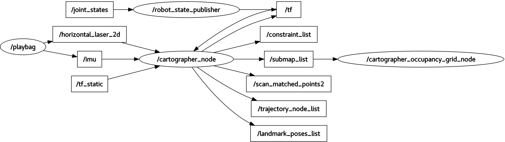
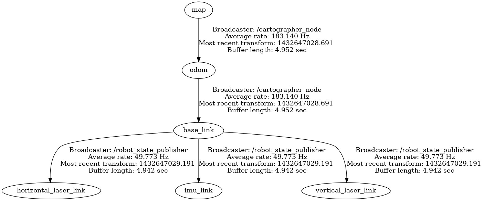

.. Copyright 2016 The Cartographer Authors

.. Licensed under the Apache License, Version 2.0 (the "License");
   you may not use this file except in compliance with the License.
   You may obtain a copy of the License at

..      http://www.apache.org/licenses/LICENSE-2.0

.. Unless required by applicable law or agreed to in writing, software
   distributed under the License is distributed on an "AS IS" BASIS,
   WITHOUT WARRANTIES OR CONDITIONS OF ANY KIND, either express or implied.
   See the License for the specific language governing permissions and
   limitations under the License.

===============================
ROS API reference documentation
===============================

Cartographer Node
=================

The `cartographer_node`_ is the SLAM node used for online, real-time SLAM.

.. _cartographer_node: https://github.com/googlecartographer/cartographer_ros/blob/master/cartographer_ros/cartographer_ros/node_main.cc

Command-line Flags
------------------

Call the node with the ``--help`` flag to see all available options.

Subscribed Topics
-----------------

The following range data topics are mutually exclusive. At least one source of
range data is required.

scan (`sensor_msgs/LaserScan`_)
  Supported in 2D and 3D (e.g. using an axially rotating planar laser scanner).
  If *num_laser_scans* is set to 1 in the :doc:`configuration`, this topic will
  be used as input for SLAM. If *num_laser_scans* is greater than 1, multiple
  numbered scan topics (i.e. scan_1, scan_2, scan_3, ...  up to and including
  *num_laser_scans*) will be used as inputs for SLAM.

echoes (`sensor_msgs/MultiEchoLaserScan`_)
  Supported in 2D and 3D (e.g. using an axially rotating planar laser scanner).
  If *num_multi_echo_laser_scans* is set to 1 in the :doc:`configuration`, this
  topic will be used as input for SLAM. Only the first echo is used. If
  *num_multi_echo_laser_scans* is greater than 1, multiple numbered echoes
  topics (i.e. echoes_1, echoes_2, echoes_3, ...  up to and including
  *num_multi_echo_laser_scans*) will be used as inputs for SLAM.

points2 (`sensor_msgs/PointCloud2`_)
  If *num_point_clouds* is set to 1 in the :doc:`configuration`, this topic will
  be used as input for SLAM. If *num_point_clouds* is greater than 1, multiple
  numbered points2 topics (i.e. points2_1, points2_2, points2_3, ...  up to and
  including *num_point_clouds*) will be used as inputs for SLAM.

The following additional sensor data topics may also be provided:

imu (`sensor_msgs/Imu`_)
  Supported in 2D (optional) and 3D (required). This topic will be used as
  input for SLAM.

odom (`nav_msgs/Odometry`_)
  Supported in 2D (optional) and 3D (optional). If *use_odometry* is
  enabled in the :doc:`configuration`, this topic will be used as input for
  SLAM.

.. TODO: add NavSatFix? Landmarks?

Published Topics
----------------

scan_matched_points2 (`sensor_msgs/PointCloud2`_)
  Point cloud as it was used for the purpose of scan-to-submap matching. This
  cloud may be both filtered and projected depending on the
  :doc:`configuration`.

submap_list (`cartographer_ros_msgs/SubmapList`_)
  List of all submaps, including the pose and latest version number of each
  submap, across all trajectories.

Services
--------

All services responses include also a ``StatusResponse`` that comprises a ``code`` and a ``message`` field.
For consistency, the integer ``code`` is equivalent to the status codes used in the `gRPC`_ API.

.. _gRPC: https://developers.google.com/maps-booking/reference/grpc-api/status_codes

submap_query (`cartographer_ros_msgs/SubmapQuery`_)
  Fetches the requested submap.

start_trajectory (`cartographer_ros_msgs/StartTrajectory`_)
  Starts a trajectory using default sensor topics and the provided configuration. 
  An initial pose can be optionally specified. Returns an assigned trajectory ID.

trajectory_query (`cartographer_ros_msgs/TrajectoryQuery`_)
  Returns the trajectory data from the pose graph.

finish_trajectory (`cartographer_ros_msgs/FinishTrajectory`_)
  Finishes the given `trajectory_id`'s trajectory by running a final optimization.

write_state (`cartographer_ros_msgs/WriteState`_)
  Writes the current internal state to disk into `filename`. The file will
  usually end up in `~/.ros` or `ROS_HOME` if it is set. This file can be used
  as input to the `assets_writer_main` to generate assets like probability
  grids, X-Rays or PLY files.

get_trajectory_states (`cartographer_ros_msgs/GetTrajectoryStates`_)
  Returns the IDs and the states of the trajectories.
  For example, this can be useful to observe the state of Cartographer from a separate node.

read_metrics (`cartographer_ros_msgs/ReadMetrics`_)
  Returns the latest values of all internal metrics of Cartographer.
  The collection of runtime metrics is optional and has to be activated with the ``--collect_metrics`` command line flag in the node.

Required tf Transforms
----------------------

Transforms from all incoming sensor data frames to the :doc:`configured
<configuration>` *tracking_frame* and *published_frame* must be available.
Typically, these are published periodically by a `robot_state_publisher` or a
`static_transform_publisher`.

Provided tf Transforms
----------------------

The transformation between the :doc:`configured <configuration>` *map_frame*
and *published_frame* is always provided.

If *provide_odom_frame* is enabled in the :doc:`configuration`, a continuous
(i.e. unaffected by loop closure) transform between the :doc:`configured
<configuration>` *odom_frame* and *published_frame* will be provided.

.. _robot_state_publisher: http://wiki.ros.org/robot_state_publisher
.. _static_transform_publisher: http://wiki.ros.org/tf#static_transform_publisher
.. _cartographer_ros_msgs/FinishTrajectory: https://github.com/googlecartographer/cartographer_ros/blob/master/cartographer_ros_msgs/srv/FinishTrajectory.srv
.. _cartographer_ros_msgs/SubmapList: https://github.com/googlecartographer/cartographer_ros/blob/master/cartographer_ros_msgs/msg/SubmapList.msg
.. _cartographer_ros_msgs/SubmapQuery: https://github.com/googlecartographer/cartographer_ros/blob/master/cartographer_ros_msgs/srv/SubmapQuery.srv
.. _cartographer_ros_msgs/StartTrajectory: https://github.com/googlecartographer/cartographer_ros/blob/master/cartographer_ros_msgs/srv/StartTrajectory.srv
.. _cartographer_ros_msgs/TrajectoryQuery: https://github.com/googlecartographer/cartographer_ros/blob/master/cartographer_ros_msgs/srv/TrajectoryQuery.srv
.. _cartographer_ros_msgs/WriteState: https://github.com/googlecartographer/cartographer_ros/blob/master/cartographer_ros_msgs/srv/WriteState.srv
.. _cartographer_ros_msgs/GetTrajectoryStates: https://github.com/googlecartographer/cartographer_ros/blob/master/cartographer_ros_msgs/srv/GetTrajectoryStates.srv
.. _cartographer_ros_msgs/ReadMetrics: https://github.com/googlecartographer/cartographer_ros/blob/master/cartographer_ros_msgs/srv/ReadMetrics.srv
.. _nav_msgs/OccupancyGrid: http://docs.ros.org/api/nav_msgs/html/msg/OccupancyGrid.html
.. _nav_msgs/Odometry: http://docs.ros.org/api/nav_msgs/html/msg/Odometry.html
.. _sensor_msgs/Imu: http://docs.ros.org/api/sensor_msgs/html/msg/Imu.html
.. _sensor_msgs/LaserScan: http://docs.ros.org/api/sensor_msgs/html/msg/LaserScan.html
.. _sensor_msgs/MultiEchoLaserScan: http://docs.ros.org/api/sensor_msgs/html/msg/MultiEchoLaserScan.html
.. _sensor_msgs/PointCloud2: http://docs.ros.org/api/sensor_msgs/html/msg/PointCloud2.html

Offline Node
============

The `offline_node`_ is the fastest way of SLAMing a bag of sensor data.
It does not listen on any topics, instead it reads TF and sensor data out of a set of bags provided on the commandline.
It also publishes a clock with the advancing sensor data, i.e. replaces ``rosbag play``.
In all other regards, it behaves like the ``cartographer_node``.
Each bag will become a separate trajectory in the final state.
Once it is done processing all data, it writes out the final Cartographer state and exits.

.. _offline_node: https://github.com/googlecartographer/cartographer_ros/blob/master/cartographer_ros/cartographer_ros/offline_node_main.cc

Published Topics
----------------

In addition to the topics that are published by the online node, this node also publishes:

~bagfile_progress (`cartographer_ros_msgs/BagfileProgress`_)
  Bag files processing progress including detailed information about the bag currently being processed which will be published with a predefined
  interval that can be specified using ``~bagfile_progress_pub_interval`` ROS parameter.

.. _cartographer_ros_msgs/BagfileProgress: https://github.com/googlecartographer/cartographer_ros/blob/master/cartographer_ros_msgs/msg/BagfileProgress.msg

Parameters
----------

~bagfile_progress_pub_interval (double, default=10.0):
  The interval of publishing bag files processing progress in seconds.

Occupancy grid Node
===================

The `occupancy_grid_node`_ listens to the submaps published by SLAM, builds an ROS occupancy_grid out of them and publishes it.
This tool is useful to keep old nodes that require a single monolithic map to work happy until new nav stacks can deal with Cartographer's submaps directly.
Generating the map is expensive and slow, so map updates are in the order of seconds.
You can can selectively include/exclude submaps from frozen (static) or active trajectories with a command line option.
Call the node with the ``--help`` flag to see these options.

.. _occupancy_grid_node: https://github.com/googlecartographer/cartographer_ros/blob/master/cartographer_ros/cartographer_ros/occupancy_grid_node_main.cc

Subscribed Topics
-----------------

It subscribes to Cartographer's ``submap_list`` topic only.

Published Topics
----------------

map (`nav_msgs/OccupancyGrid`_)
  If subscribed to, the node will continuously compute and publish the map. The
  time between updates will increase with the size of the map. For faster
  updates, use the submaps APIs.

Pbstream Map Publisher Node
===========================

The `pbstream_map_publisher`_ is a simple node that creates a static occupancy grid out of a serialized Cartographer state (pbstream format).
It is an efficient alternative to the occupancy grid node if live updates are not important.

.. _pbstream_map_publisher: https://github.com/googlecartographer/cartographer_ros/blob/master/cartographer_ros/cartographer_ros/pbstream_map_publisher_main.cc

Subscribed Topics
-----------------

None.

Published Topics
----------------

map (`nav_msgs/OccupancyGrid`_)
  The published occupancy grid topic is latched.
